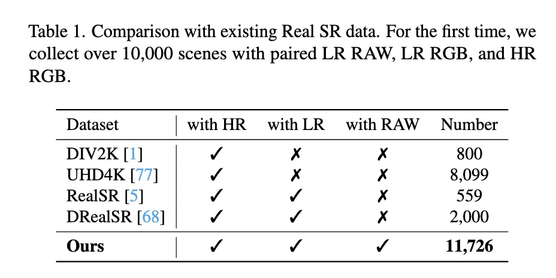

# Unveiling Hidden Details: A RAW Data-Enhanced Paradigm for Real-World Super-Resolution

   

## :bookmark: News!!!
- [x] 2024-11-9 **Arxiv Version has been released.**

## TODO
- [ ] Release RealSR-RAW Dataset
- [ ] Release RAW Adapter

## Abstract

Real-world image super-resolution (Real SR) aims to generate high-fidelity, detail-rich high-resolution (HR) images from low-resolution (LR) counterparts. Existing Real SR methods primarily focus on generating details from the LR RGB domain, often leading to a lack of richness or fidelity in fine details. In this paper, we pioneer the use of details hidden in RAW data to complement existing RGB-only methods, yielding superior outputs. We argue that key image processing steps in Image Signal Processing, such as denoising and demosaicing, inherently result in the loss of fine details in LR images, making LR RAW a valuable information source. To validate this, we present RealSR-RAW, a comprehensive dataset comprising over 10,000 pairs with LR and HR RGB images, along with corresponding LR RAW, captured across multiple smartphones under varying focal lengths and diverse scenes. Additionally, we propose a novel, general RAW adapter to efficiently integrate LR RAW data into existing CNNs, Transformers, and Diffusion-based Real SR models by suppressing the noise contained in LR RAW and aligning its distribution. Extensive experiments demonstrate that incorporating RAW data significantly enhances detail recovery and improves Real SR performance across ten evaluation metrics, including both fidelity and perception-oriented metrics. Our findings open a new direction for the Real SR task, with the dataset and code will be made available to support future research.

## Motivation

Existing RealSR methods focus on LR RGB images, as shown in (a). However, LR RGB images often suffer from detail loss due to ISP, as shown in (b), which exacerbates the challenges of RealSR. Therefore, we think: **Can the detail-rich LR RAW information assist Real SR in generating better image details?**

(a) Equipped with LR RAW, the performance of existing RGB-only Real SR models is significantly improved. (b-c) LR RAW also aids Real SR models in generating superior high-fidelity details that are hard to learn in the LR RGB space, thereby significantly enhancing visual quality.

## Dataset

## RAW adapter

## Cite US
Please cite us if this work is helpful to you. 

## Acknowledgments
Contact email for Long Peng: longp2001@mail.ustc.edu.cn. This research was conducted while Long Peng was an intern at Huawei Noah’s Ark Lab.

The basic code is partially from the below repos.
- [BasicSR]([link](https://github.com/XPixelGroup/BasicSR))
